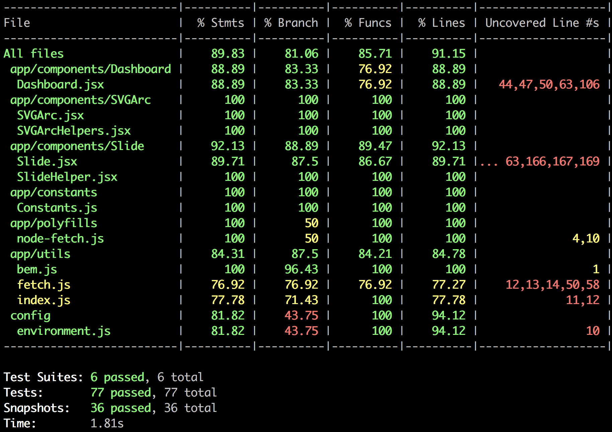

## Credit Score Component

## Goal

Create a slider component that animates a circular path according to a predefined value, while also having a 'frosted glass' background.

On click, the slider has to animate a second panel with a new set of information.

On desktop, there are 2 sliders, one showing the credit score, the other showing the current offers.
On mobile, the offers slide is replaced by one prompting the user to transfer their balance.

## Highlights

To achieve the background, the solution I chose was to have a fixed-position element as big as the main app's background, apply a 'blur' and a 'brightness' filter on it and then only show the part of it that I needed by using 'clip-path' with a 'circle' shape.

For the circular path, I used an svg path that was as simple as possible, namely just an arc with a predefined stroke width.

The app only uses React to manage state, as adding Redux would have added unnecessary complexity, also taking the focus away from the goal.

Styling is achieved via external .scss files, and the naming of elements follows the BEM convention. External stylesheets are kept in the same place as the component for increased modularity, as are the test files.

Testing is done with Jest, using snapshot testing for function outputs and for the rest, asserting that functions are called only when they need to. Testing coverage is as close to 100% as possible without making the tests unnecessarily brittle.

The solution could benefit from more cross-browser compatibility (i.e. IE support), and that would indeed be achieved in a production setting.

---

### Supported browsers:

Chrome, Firefox, Safari, Opera, Edge

### Supported platforms:

Mac OS X, Windows 8, Windows 10, Android, iOS

---

### Unit testing coverage:

## Running the app

- Run: `yarn start:webpack`
- Run: `yarn start:dev` _(in a new terminal)_
- Goto: `http://localhost:3030/`
